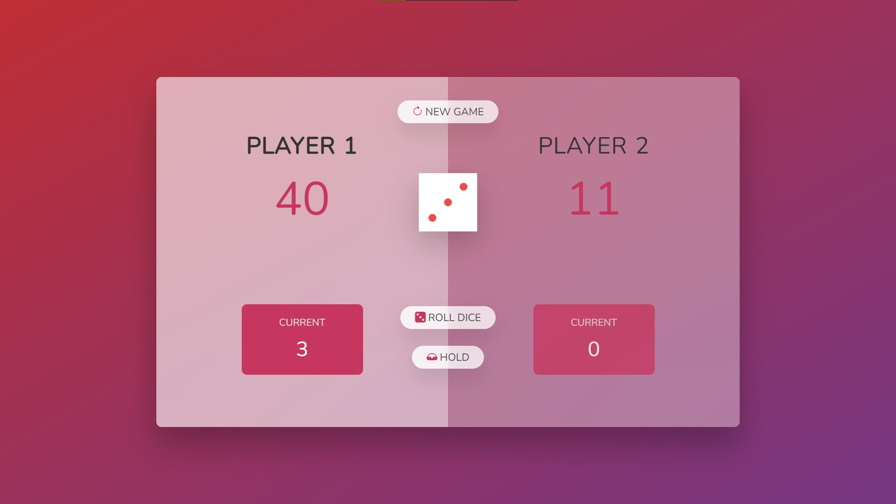
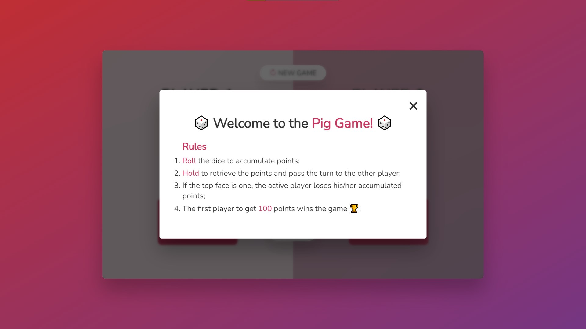
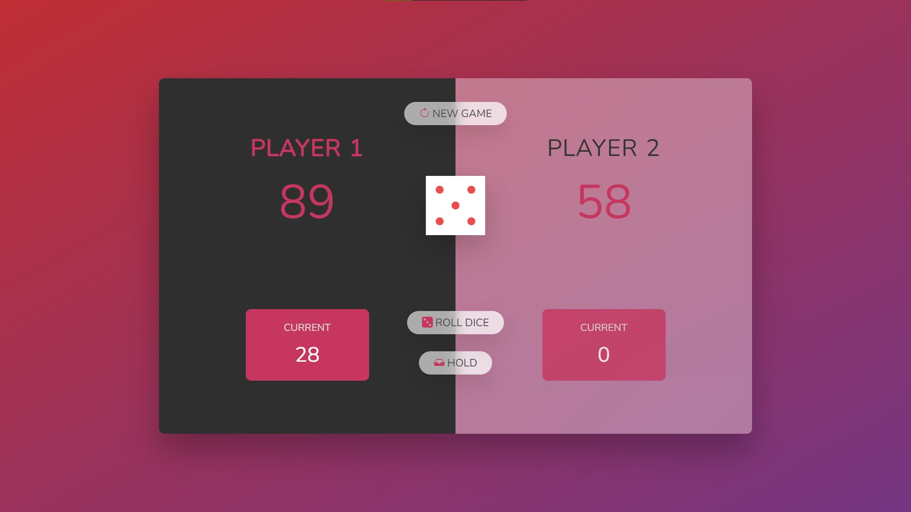

# Pig-Game

A simple two-player game implemented with **Typescript** and **JQuery**.

## Rules

1. Roll the dice to accumulate points;
1. Hold to retrieve the points and pass the turn to the other player;
1. If the top face is one, the active player loses his/her 1. accumulated points;
1. The first player to get 100 points wins the game 🏆!

## Requirements

-   Nodejs `v16.14.0`;
-   NPM `v8.3.1`.

## Run locally

In order torun this project locally, run the following commands:

-   Clone this repository with `git clone https://github.com/William-Fernandes252/Pig-Game.git`;
-   Install the dependencies with `npm install`;
-   And whenever you want to build the project, run `npm build`;

## Snapshot

<h3 style="text-align:center">Welcome page</h3>

<h3 style="text-align:center">Win</h3>

